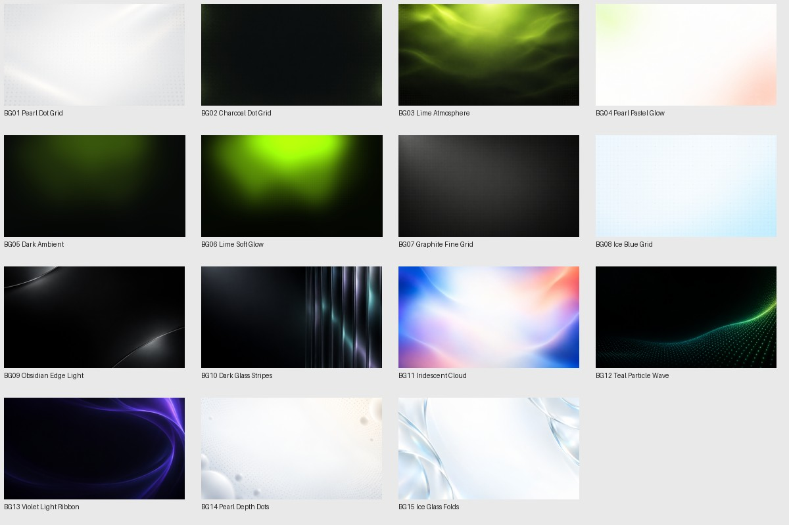

# ShiftyMotion Skills

参考复刻、原创 UI 动效、丝滑交互、镜头与分层光效。支持 AE 与 HTML/JavaScript；由任务决定实现工具。

- [详细复刻模板与原创需求模板](references/prompt-templates.md)
- [UI 真实性与素材选择](references/intake-and-ui.md)
- [背景选择与动画说明](references/backgrounds.md)
- [背景预览（本地浏览器打开）](assets/backgrounds/index.html)
- [83 个音效试听（本地浏览器打开）](assets/sfx/index.html)

## 使用

将完整 `shifty-motion` 文件夹交给支持技能的 Agent 安装到其技能目录，或明确让它读取 `SKILL.md`，保持 assets、references 与 scripts 的相对结构。显示名为 **ShiftyMotion Skills**，技能标识为 `shifty-motion`，支持 $ 调用的环境可使用 `$shifty-motion`。

你提供参考/目标、品牌文案和可用素材；Agent 先补齐关键选择，再设计、制作并检查视频。真实 UI、按外观重绘、概念 UI 是不同选项；网页采集与 Figma 都是按需采用。可以只用已有图片，不需要采集网站。

背景支持指定文件、随包库、原创与外部素材；静态 PNG 需要另加动画才能产生独立波动、点阵光效和视差。包含 15 张独立原图及一张拼图参考；原图没有被降分辨率。原有 19 种动作配方与 83 个 WAV 保留。

本包为独立对外版 v3.3.0，不包含产品专属配置，也不自动安装或覆盖任何现有技能。参考分析图保留用于学习，不视为目标产品素材；声音来源边界见 [来源说明](references/sfx-sources.md)。
