# Higgsfield：16 段参考证据与可复用组合

更新日期：2026-09-12。源素材以 IMG_8244–IMG_8259 编号追溯；分享包不依赖原视频所在机器。本目录中的小图仅用于学习、比对，不应拿来当成目标产品资产或重新发布的成片素材。

## 证据边界

16 段总长 391.73 秒。全片按 2 fps 顺序抽样，共 783 帧；每段选一个核心交接以 12 fps 加密，共 338 帧；三段额外打字分析 63 帧；另核对全部 16 个尾帧。合计查看 1,200 张检查帧。这是覆盖首尾的顺序抽样与局部加密，不是穷举所有原始帧。
所有时间均为各源录屏内的近似重采样时间，非项目时间或精确原始 PTS。加密间距约 83 ms；原录屏为可变帧率，不可由平均帧率推断原作者动画帧率。精确起止需返回原片再逐帧定位。
全部音轨为 AAC、44.1 kHz、双声道。已离线解码、检查全长包络及局部能量突增；未可靠直接试听，未分离 BGM/旁白/SFX。音色、材质、空间感和来源均不能由波形确定。声音条目是建议方案，详见 [音效设计](sfx-design.md)。
8251 与 8250 约 39–46 秒的内容有重复，但录屏裁切与节奏不同，单独分析其拖入动作，不把它们算成两种独立原创模式。片尾的手机控制中心不属于参考作者的转场。

## 逐片记录

### 01 · IMG_8244.MP4 · 输入框长出附件，再交给编辑器

时长 29.56s；核心加密约 8.30–9.55s。

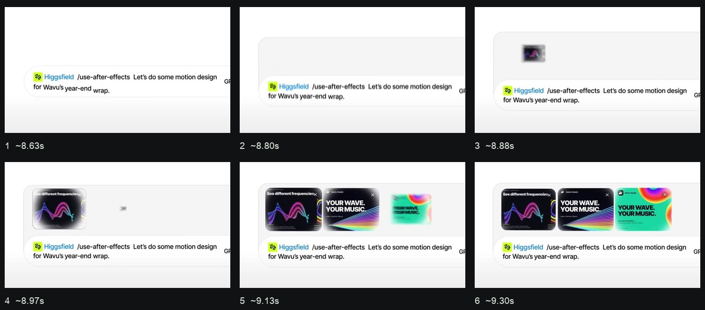

**全片流程：** 0-2.4s 光标与标题组装；2.4-5.4s 命令输入条、模型端近景；5.4-8.0s 真人语音场景；8.0-10.8s 文字续写、附件展开、提交；10.8-16.3s 真人与 AE 窗口、项目目录；16.3-22.4s 口令、图层累积与海报；22.4-28.8s 真人口令与人物素材进入海报；尾段为系统控制中心。

**精彩组合：** 先为附件腾出空间，再让图片错峰填入

**可见证据：** 约 8.63s 输入内容已换行；8.72-8.80s 容器向上扩高；8.88s 第一张小图出现，9.05s 第二张、9.13s 第三张接续。文字和输入区域始终留在画面里，观众可以看出图片属于同一个请求。

**实现推测：** 可用同一容器的高度动画、固定文字基线和独立附件层实现。图像由小到大并短暂模糊，不能把整张输入框截图做非等比拉伸。

**调校起点：** 建议先扩容 0.2-0.35s，附件间隔 0.08-0.14s，每张收稳约 0.25-0.4s。附件未完全收稳时下一张开始。

**通用应用：** 正脸图与三视图依次落入主体附件区；保留同一提示词，画面表达的是补充参考资料。

**建议音效（非原片试听结论）：** 建议：短密打字簇、两三次轻落位、提交确认。这里只是配声方案，未试听确认原片音色。

### 02 · IMG_8245.MP4 · 实景缩略图被拾起，投入输入框

时长 20.39s；核心加密约 3.50–5.40s。

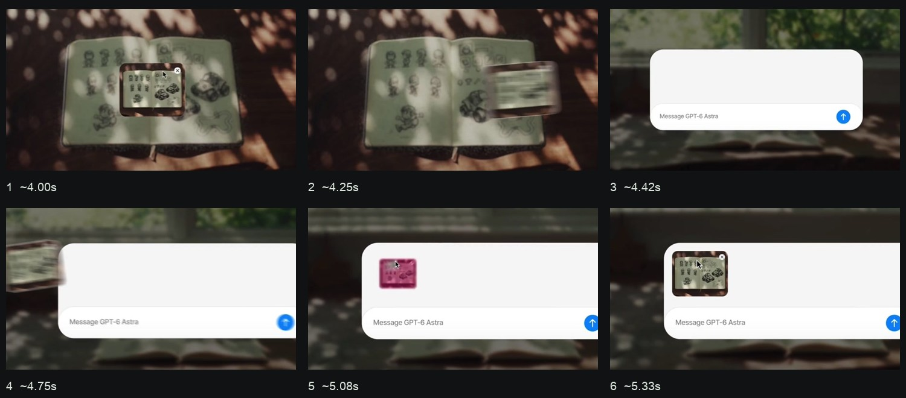

**全片流程：** 0-2.4s 赛车主题标题；2.4-4.4s 草图本与浮起缩略图；4.4-7.8s 输入框接住图片、打字和提交；7.8-9.5s 草图扫描；9.5-12.3s 生成步骤逐行出现；12.3-15.8s 风格和视角四选一；15.8-18.0s 完成步骤、导出提示；18.0-19.8s 三维模型轮播；之后为控制中心。

**精彩组合：** 拾起、横向带出、回到槽位、释放收缩

**可见证据：** 约 4.08-4.25s 缩略图偏移并产生倾斜/模糊；4.42s 新输入容器已建立；4.75s 图片从左侧回来；5.08s 明显缩成附件尺寸，5.17s 局部亮起，5.33s 稳定。

**实现推测：** 把拖动物体与鼠标作为一个临时组，槽位在另一固定坐标系中；接近目标后匹配位置和尺寸，松手再解除绑定。转场中背景也变了，不是始终同一实景机位。

**调校起点：** 建议拖动 0.35-0.6s，倾角约 3-6 度；释放后用 0.16-0.26s 收成附件。落点高亮只维持短暂一拍。

**通用应用：** 人物图上传可借这个视觉语法；若真实产品录屏只支持文件选择，制作示意时不把动画拖入说成真实拖放功能。

**建议音效（非原片试听结论）：** 建议：拾起轻触、运动短掠过、落位软扣合三层；不要三处都叠同样的大 whoosh。

### 03 · IMG_8246.MP4 · 从小按钮展开完整输入面板

时长 28.23s；核心加密约 2.15–3.45s。

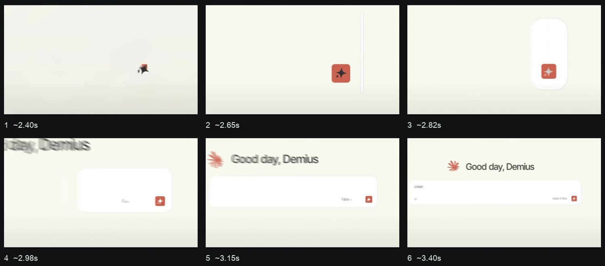

**全片流程：** 0-2.4s 紫色插件片头；2.4-5.8s 图标、输入框展开、打字提交；5.8-8.3s 工作状态文字；8.3-12.6s AE 形状与玻璃材质；12.6-17.2s 再次输入、插件安装、背景创建；17.2-23.3s 灯光/背景参数与颜色变化；23.3-24.8s 参考图请求；24.8-27.4s 仪表板模块生成；之后为系统界面。

**精彩组合：** 点、竖胶囊、横面板，逐级建立容器

**可见证据：** 约 2.48s 小方形按钮可见；2.65s 右侧竖线出现；2.73-2.90s 竖线变成圆角块；2.98-3.23s 块向横向展开并出现标题，3.4s 已开始输入。

**实现推测：** 按钮与圆角容器分层；通过宽高和圆角变化建立空间，再揭示内部文字。缓动、光标路径和是否使用 AE 表达式无法由成片确定。

**调校起点：** 建议容器展开 0.4-0.6s，文字比容器晚 0.12-0.2s，先清楚建立轮廓再开始打字。尺寸动画只施于外壳。

**通用应用：** 可把产品图标作为画面锚点，平顺带出真实输入区域。沿用目标品牌的底色与强调色，不默认沿用参考配色。

**建议音效（非原片试听结论）：** 建议：细短启动音接柔软展开声，输入阶段改用干燥键击。

### 04 · IMG_8247.MP4 · 设计板收成卡叠，再装进文件夹

时长 27.33s；核心加密约 10.70–12.80s。

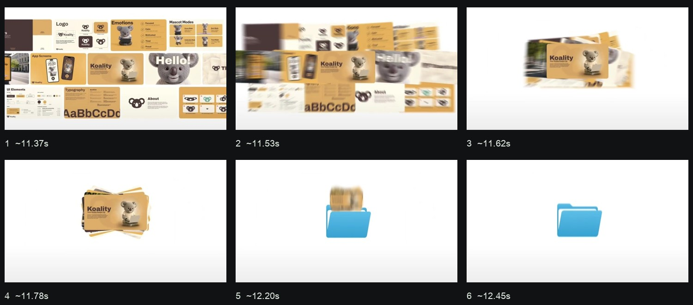

**全片流程：** 0-0.5s 真人标题；0.5-2.3s MCP 开关；2.3-7.7s 文字与步骤列表；7.7-10.3s 三个品牌方案、选中中间项；10.3-14.3s 品牌板铺开、收叠、装文件夹和命名；14.3-17.5s 真人与 Not yet；17.5-20.5s 再一轮文字步骤；20.5-24.3s 商店竖图横向浏览；24.3-26.9s app demo 和手机结果；尾部控制中心。

**精彩组合：** 主卡保持可辨认，周边资料收拢到它背后

**可见证据：** 约 11.45s 仍是满屏设计板；11.53-11.70s 缩成有前后层次的卡叠；12.12s 卡叠上提且文件夹出现；12.20-12.37s 落入文件夹；12.45s 文件夹恢复稳定。

**实现推测：** 各卡片共享收拢目标，但位置、旋转和层级不同；文件夹前盖充当遮挡蒙版，必须在卡片前方。整个截图缩小无法得到真实收叠感。

**调校起点：** 建议收叠 0.3-0.45s，保留主卡约 0.2s，再落入 0.25-0.4s。文件夹跟随轻压缩一次，避免多次弹跳。

**通用应用：** 完成男女正脸/三视图后，以主体卡为主卡收拢，接主体库；比另开一张绑定步骤标题更连续。

**建议音效（非原片试听结论）：** 建议：多张轻纸片聚合声，最后一声较低的软落位；不需要给每张卡单独配强音。

### 05 · IMG_8248.MP4 · 选择确认与下一组结果共用一个滚动空间

时长 31.04s；核心加密约 20.00–21.70s。

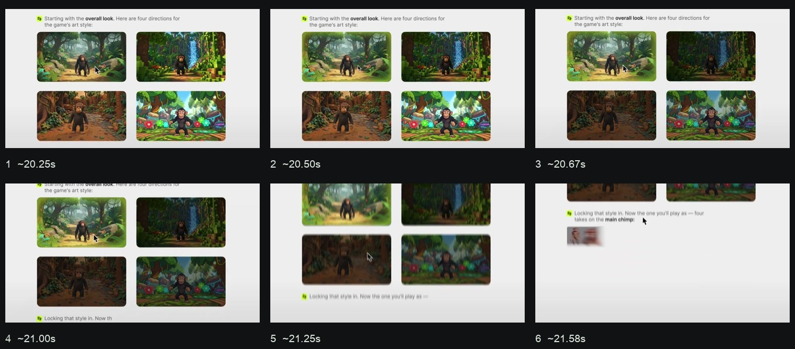

**全片流程：** 0-1.9s 品牌/蝴蝶；1.9-7.4s PDF 附件、长句输入和提交；7.4-10.5s 分析列表；10.5-14.1s 游戏建议卡组；14.1-17.7s Yes 确认与 MCP 开关；17.7-21.4s 画风四选一；21.4-23.3s 角色四选一；23.3-25.4s 环境选择；25.4-28.4s HUD 选择及总结；28.4-30.3s 构建提示和游戏标题；末尾控制中心。

**精彩组合：** 选中项保亮，其他项退暗，下一组从下方接上

**可见证据：** 约 20.50-20.83s 左上项保持亮度，其余三项逐渐变暗；21.00s 下一行回复已经出现；21.17-21.50s 整个旧卡组上移；21.58s 新角色缩略图开始出现。

**实现推测：** 使用同一滚动容器容纳旧结果、确认文案和新结果，选中状态与滚动分别调度。变暗是比较选择的证据，不只是装饰绿框。

**调校起点：** 建议选中反馈 0.15-0.25s，保留比较画面 0.25-0.45s，后续滚动 0.3-0.5s；新卡可在旧组退出前启动。

**通用应用：** 选择主体后让真实列表变暗/聚焦，并接输入框的 @ 标签；保留头像与姓名，让观众知道刚选中了谁。

**建议音效（非原片试听结论）：** 建议：单次确认轻 click，滚动用很轻的空气擦过；新列表首项落位可以配一声短 tick。

### 06 · IMG_8249.MP4 · 批量占位到真实结果，两次错峰形成节奏

时长 38.68s；核心加密约 13.30–15.80s。

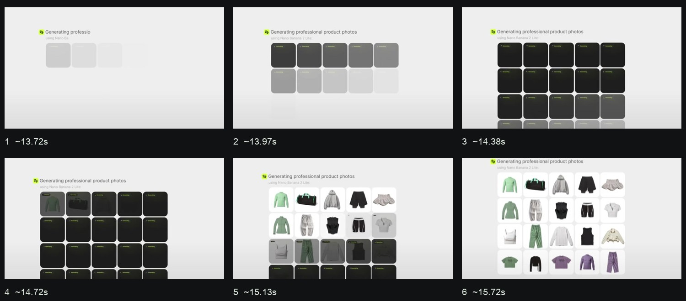

**全片流程：** 0-2.4s 品牌与额度标题；2.4-5.5s 服装参考板转 PDF；5.5-10.4s 附件、输入、提交；10.4-13.3s 分析步骤；13.3-15.9s 产品图片矩阵；15.9-21.4s 人像矩阵及多次选择；21.4-25.4s 服装上身矩阵；25.4-28.2s 视频生成状态；28.2-33.3s 三列视频结果；33.3-37.9s ZIP、PDF 交付卡与结束文案；之后为系统界面。

**精彩组合：** 先铺槽位，再按相同阅读顺序揭示图片

**可见证据：** 约 13.72s 浅灰占位从第一行开始；14.05-14.47s 黑色生成卡逐行补齐；14.72s 第一张真实产品出现；15.22s 前两行已清楚；15.72s 下排也接近完成。

**实现推测：** 为每个格子记录出现时间和内容就绪时间，保留稳定网格间距。画面同时包含适度镜头拉回；不能只用一个总透明度覆盖整组。

**调校起点：** 建议槽位按行错开 0.08-0.14s，结果再启动第二轮错峰；主体库少量头像缩短为 2-4 张，避免照搬大矩阵。

**通用应用：** 用于男女资产生成和主体库入库展示：占位对应真实输出数，已有结果直接复用用户照片，不能暗示生成更多张。

**建议音效（非原片试听结论）：** 建议：稀疏颗粒式 tick 按行配音，最终揭示用一声软确认；密集网格不要变成机关枪。

### 07 · IMG_8250.MP4 · 从点击局部扩展为转场，再进入可操作结果

时长 57.86s；核心加密约 4.25–5.60s。

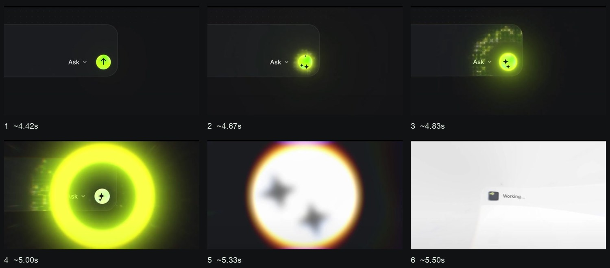

**全片流程：** 0-2.3s Apps 片头；2.3-8.7s 请求、按钮变形/光环、工作卡和链接；8.7-19.7s 3D app、打字、滑板位置/机位调整；19.7-21.8s 真人结果；21.8-28.5s 家具站生成与页面浏览；28.5-32.2s 移动版请求/缩成手机；32.2-35.4s 广告 app 请求和结果；35.4-43.3s 更新趋势、模板、头像/Logo 上传和生成；43.3-52.5s 证件照 app、上传、服装/背景/比例切换；52.5-55.8s 域名请求与连接；55.8-57.4s 应用墙；末尾控制中心。

**精彩组合：** 按钮反馈扩大为镜头通道，但只在大段落使用

**可见证据：** 约 4.50s 发送按钮亮起；4.67s 箭头转为星形；4.75s 点状环出现；4.92-5.25s 圆环扩大越出画面；5.33-5.50s 接入浅色 Working 卡。

**实现推测：** 按钮图标替换、局部光场、环形遮罩和相机推进叠加。后续 3D 拖动与真实视频结果属于内容演示，不能只靠截图缩放替代。

**调校起点：** 建议局部反馈 0.12-0.2s；需要章节转场时才延伸 0.4-0.65s 大环。普通参数选择只用局部反馈。

**通用应用：** 可用于资产生成结束转主体库的章节交接；保留当前项目背景纹理，并把大面积发光控制在短窗口。

**建议音效（非原片试听结论）：** 建议：点击脆点、短上升蓄势、柔低频展开三层，重音放在新画面接管时；不声称原片用了这些声源。

### 08 · IMG_8251.MOV · 双素材拖入：头像和 Logo 共享明确落点

时长 7.88s；核心加密约 0.50–2.20s。

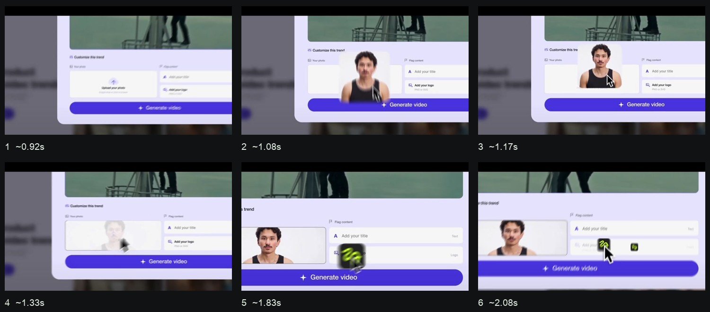

**全片流程：** 0-0.8s 模板弹窗推近；0.8-1.6s 头像上移并落进左侧槽位；1.6-2.2s Logo 拖入右侧槽位；2.2-4.3s 生成按钮与旗帜结果；4.3-6.2s 下一应用请求；6.2-7.88s 新的证件照界面。它与 8250 的约 39-46s 内容重复，但裁切、节奏不同。

**精彩组合：** 拖动物体大于槽位，松手时再缩回槽位

**可见证据：** 约 1.00s 头像从画面下方进入；1.08-1.25s 头像暂时覆盖输入区，鼠标跟随；1.33s 头像半透明并开始收进容器；1.67s 左槽位稳定；1.83-2.08s Logo 以同样语法进入右槽位。

**实现推测：** 临时拖拽层高于表单、按钮；落位后切回槽位内部的裁切层。鼠标抓取点不应在运动中滑动。高亮、裁切和照片必须共享坐标。

**调校起点：** 建议先用 0.25-0.4s 变焦建立目标，再用 0.25-0.45s 拖入，释放后 0.15-0.25s 缩回；第二素材提前启动以缩短空等。

**通用应用：** 最适合主体绑定的正脸图与三视图。保留两种素材角色，不把三视图压成头像比例；可用 contain 留底色。

**建议音效（非原片试听结论）：** 建议：两次不同轻重的拾起/吸附，第二次稍轻，生成按钮单独确认。

### 09 · IMG_8252.MP4 · 打字驱动卡片切换，而非独立轮播

时长 9.73s；核心加密约 5.40–7.30s。

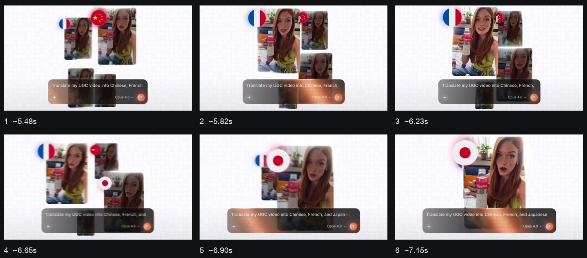

**全片流程：** 0-1.2s 字母和声波图标聚合；1.2-3.0s 品牌标题收稳；3.0-4.2s 多尺寸竖视频卡组与输入框；4.2-5.4s Chinese 文案/中国标识；5.4-6.5s French 文案/法国卡成为主角；6.5-8.3s Japanese 文案/日本卡扩大；8.3-9.4s 切到真人广告画面；尾端控制中心。

**精彩组合：** 文案的语义节点决定谁成为视觉主角

**可见证据：** 约 5.4-5.9s 法国标识卡向前、其他卡留在后方；6.57s 日本标识出现；6.73-7.07s 日本卡移到中央并放大，其余卡退后；输入框位置大体持续。

**实现推测：** 给每个语言词设置时间标记，使用标记启动对应卡片。输入和卡组共用时间表，文字不需要每个字符都加缩放。

**调校起点：** 建议每个语义节点卡组交接 0.3-0.45s，主卡清晰停留约 0.5-0.8s；其他卡只轻移动或变暗。

**通用应用：** 提示词出现 @Genevieve 与 @Jacob 时，分别把相应主体卡带到前景，再收成两枚主体标签。

**建议音效（非原片试听结论）：** 建议：打字按短词簇，切换主卡有很轻的空间移动音；国旗出现不等于能从波形判定语言或声音类别。

### 10 · IMG_8253.MP4 · 功能标签带动竖幅扩成横幅

时长 14.57s；核心加密约 6.10–7.50s。

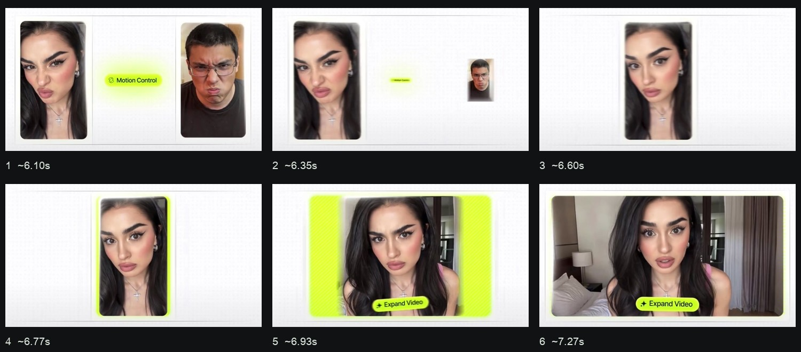

**全片流程：** 0-2.3s Claude 与 MCP 连接条、功能标签；2.3-3.8s 人像与 Motion Control 标签；3.8-6.3s 两个人像动作对照；6.3-8.9s 保留女像并扩为横幅；8.9-11.3s 大标题缩回和逐字建立；11.3-12.4s 人像与商品卡拖入；12.4-13.9s 户外广告结果；之后为控制中心。

**精彩组合：** 先统一主体中心，再扩展画幅两侧

**可见证据：** 约 6.35s 男像与功能标签缩走；6.52-6.68s 女像居中；6.85s 两侧绿色区域展开；7.02s 宽画面开始显现；7.27s 横幅和 Expand Video 标签稳定。

**实现推测：** 容器宽度与裁切范围变化，主体尺度连续。画幅扩展包含新的背景内容，不是把原人脸横向拉宽。

**调校起点：** 建议先居中 0.2-0.3s，再扩宽 0.3-0.5s；新画面用已有完整结果揭示，内容适配用 cover/contain 而非 scaleX。

**通用应用：** 替换廉价的空比例框：用真实 3:4 人像卡与 16:9 三视图承载比例标签；不同照片之间应明确换内容而非假装同一张扩图。

**建议音效（非原片试听结论）：** 建议：短扫动配扩宽，落稳给一个温和 click；整体比大章节转场轻。

### 11 · IMG_8254.MP4 · 连接状态、生成矩阵和主题切换的短组合

时长 9.83s；核心加密约 3.25–4.75s。

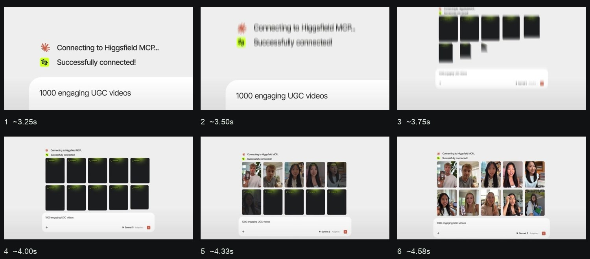

**全片流程：** 0-1.4s 品牌和模型名；1.4-3.3s 请求与连接状态；3.3-4.8s 十张占位/结果矩阵；4.8-6.3s 结果退出、黑底 Supercomputer 标题；6.3-8.3s 新请求打字及提交近景；8.3-9.3s 结束字幕；末尾控制中心。

**精彩组合：** 视角拉回时让矩阵补齐，避免先等完再移动

**可见证据：** 约 3.33s 输入和连接文字仍在；3.58s 第一张大卡入场；3.75s 镜头拉回同时其余卡逐张补入；4.17s 第一张结果显现；4.58s 两排结果大致清楚。

**实现推测：** 相机拉回与卡片错峰并行，整组布局事先存在。进度内容与结果遮罩独立，不能把卡片数量读成实际生成了 1000 条。

**调校起点：** 建议相机拉回 0.35-0.5s、卡片延迟 0.06-0.1s，留 0.4-0.7s 矩阵结果；只是教程节奏起点。

**通用应用：** 用于主体库整体展示：主卡落稳后拉回，露出另一位角色和真实库界面，随后进入调用步骤。

**建议音效（非原片试听结论）：** 建议：短连接确认、轻连点和整体展开声。文字状态本身不能证明声音属于系统提示。

### 12 · IMG_8255.MP4 · 菜单选择被保留成可复用标签

时长 21.91s；核心加密约 11.10–14.50s。

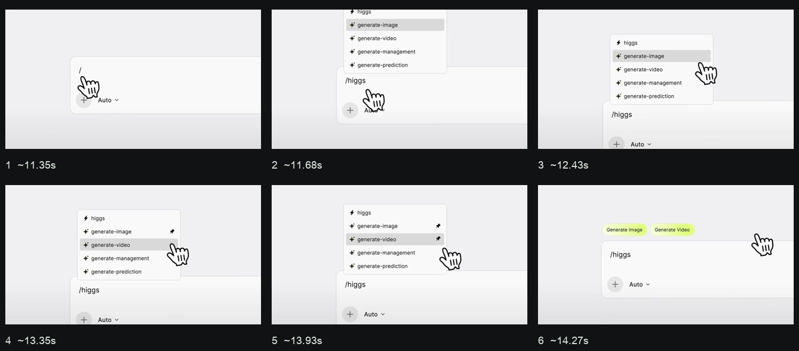

**全片流程：** 0-1.2s Cursor/MCP 品牌和输入框；1.2-3.6s 加号菜单与开关；3.6-7.3s 请求打字及发送；7.3-10.3s 真实工作结果；10.3-14.3s /higgs 菜单、两项操作选中并收成标签；14.3-16.3s 图像附件堆叠进入；16.3-18.6s 选生成模式、补充指令、提交；18.6-21.3s 工具执行和生成卡；尾部控制中心。

**精彩组合：** 输入符号、展开列表、标记选择、留下标签

**可见证据：** 约 11.35-11.60s /higgs 字符逐步出现；11.68s 列表出现；12.77-13.27s 第一行右侧标记改变；13.77s 第二行也被选；14.02s 菜单消失而两个标签出现在输入框上方。

**实现推测：** 状态机控制菜单和标签显隐，选中行的信息持续存在。不是每次点击都放大整页；大光标也需在落点收稳。

**调校起点：** 建议打开列表 0.15-0.25s、选择反馈 0.1-0.18s、标签交接 0.2-0.35s；实际选中两项要有辨认停留。

**通用应用：** 直接映射到 @ 主体选择：输入 @ 后先显示真实候选，再选姓名与头像，最终留下同一主体标签。

**建议音效（非原片试听结论）：** 建议：/ 与关键词输入用短打字，菜单打开一声轻 pop、选中一声干 click、标签落位一声更软的 tick。

### 13 · IMG_8256.MP4 · 从细节分析到参考尺度，镜头有明确理由

时长 25.69s；核心加密约 8.45–9.85s。

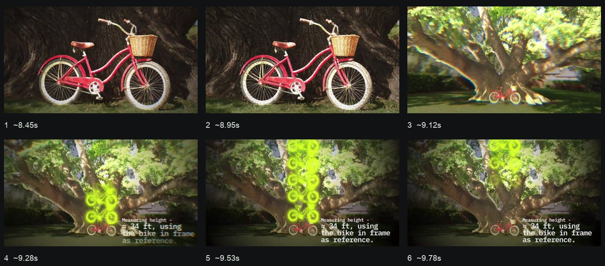

**全片流程：** 0-1.8s 鸟与品牌；1.8-3.1s 树木实景转参考图；3.1-6.3s 输入和发送；6.3-8.4s 分析状态、树木扫描；8.4-10.2s 自行车近景到参照测量；10.2-12.9s 树皮/叶子/健康判断；12.9-17.8s 结果文字、连接状态；17.8-20.1s 外观四选一；20.1-22.1s 室内四选一；22.1-25.3s 模型构建与放大；尾端控制中心。

**精彩组合：** 先看清参照物，再拉回解释它和整体的关系

**可见证据：** 约 8.45-9.03s 镜头停在自行车；9.12s 快速拉回树木全景；9.20-9.62s 绿色自行车轮廓向上复制为尺度串，旁边出现测量文字。

**实现推测：** 局部裁切镜头、跟踪在源图坐标上的标注、顺序复制图标共同表达比较；视频里的测量数值不是本报告验证过的事实。

**调校起点：** 建议局部细节停留 0.35-0.6s，拉回 0.25-0.4s，标注按次序出现；对脸部不叠密集扫描纹理。

**通用应用：** 用于解释正脸负责身份、三视图负责服装和轮廓：先聚焦脸，再拉回三视图，以短文字说明两种素材作用。

**建议音效（非原片试听结论）：** 建议：扫描用低音量短纹理，拉回一声短掠过，图标复制用稀疏轻 tick。

### 14 · IMG_8257.MP4 · 局部边缘光引出参数，主次清楚

时长 18.83s；核心加密约 3.00–4.25s。

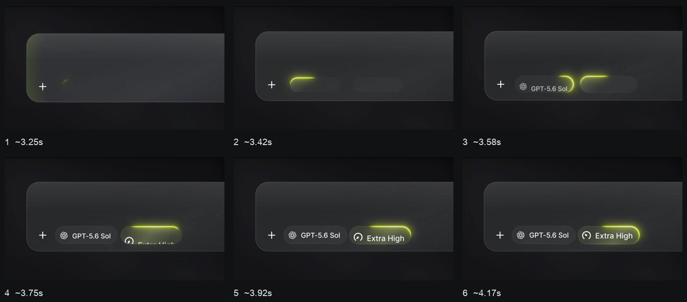

**全片流程：** 0-2.8s 模型品牌轮换与 Supercomputer；2.8-4.3s 输入面板/模型和强度标签；4.3-6.3s 打字、拖附件、发送；6.3-11.7s 大批竖视频结果纵向浏览；11.7-14.1s 卡组与工作面板并置；14.1-16.8s 单个执行面板聚焦与结果；16.8-18.4s 全屏广告示例；末尾控制中心。

**精彩组合：** 沿胶囊边缘移动的短光段，比完整荧光框克制

**可见证据：** 约 3.42s 模型胶囊左上开始出现短亮线；3.58-3.75s 亮线走向右侧，模型文字稳定；第二个强度胶囊晚一点重复，3.92-4.17s 内容保持可读。

**实现推测：** 可用沿圆角路径的短 dash 或蒙版位移，再叠低强度模糊光晕。光是跟随控件边缘，不是画面空间里独立漂浮。

**调校起点：** 建议两个控件错开 0.15-0.25s，单个光段通过 0.35-0.6s；落稳后迅速减弱，不做永久发光边框。

**通用应用：** 给实际模型名称、分辨率、比例和数量做一次短边缘提示；颜色沿用目标品牌，文字对比优先。

**建议音效（非原片试听结论）：** 建议：参数启用用轻细 click；光段可以不配音，避免每个视觉细节都制造噪声。

### 15 · IMG_8258.MP4 · 角色接力、扇形卡叠与证据矩阵

时长 25.18s；核心加密约 13.20–15.20s。

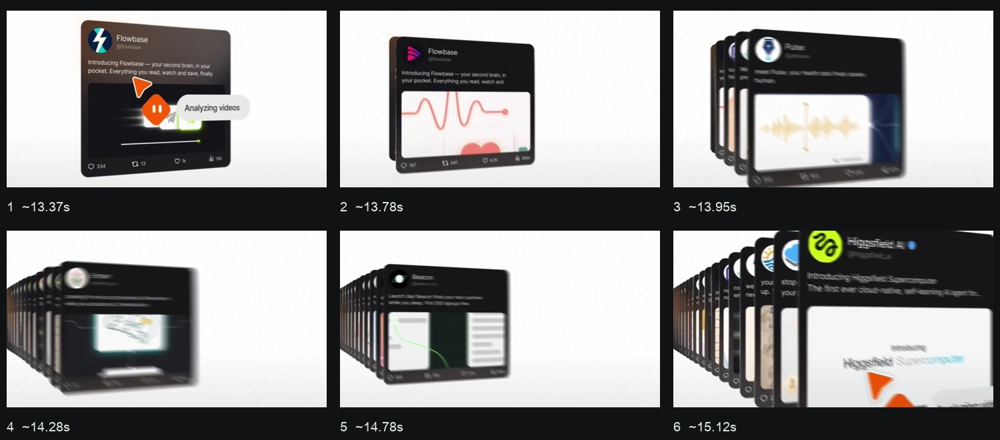

**全片流程：** 0-2.5s 多机器人品牌与空间穿越；2.5-5.7s 对话和连接；5.7-10.8s 侧栏机器人列表依次展示；10.8-13.7s 对话与单张社媒卡分析；13.7-16.1s 卡叠快速浏览到特定帖子；16.1-17.3s 互动数值近景；17.3-19.8s 分析文字；19.8-23.1s 评论滚动；23.1-24.8s 拉回大量证据矩阵；尾端控制中心。

**精彩组合：** 固定一个深度方向，快速换前卡仍能辨认卡组

**可见证据：** 约 13.78s 新卡出现；13.87-14.45s 越来越多卡向左后方叠出，前卡不断替换；14.53-14.95s 深度方向维持；15.12s 特定 Higgsfield 卡移到前面并放大。

**实现推测：** 按固定索引计算卡片深度、位置、尺寸和层级，前卡跨越后更新索引。假三维即可完成部分视觉，但不应随意翻转 z-order。

**调校起点：** 建议快速浏览时一张只占 0.08-0.16s，目标卡最后保留 0.5-0.9s；重要文字不用要求观众在快速卡叠中读完。

**通用应用：** 开头素材/热点数据墙可用这种卡叠筛选，再由主证据卡接管；主体操作只保留少量卡，避免喧宾夺主。

**建议音效（非原片试听结论）：** 建议：短纸片/数字翻页连动音，挑中主卡才给明确落位重音；数字增加可用较轻颗粒。

### 16 · IMG_8259.MP4 · 思考链路展开，再巡游多个解释模块

时长 25.03s；核心加密约 17.00–18.50s。

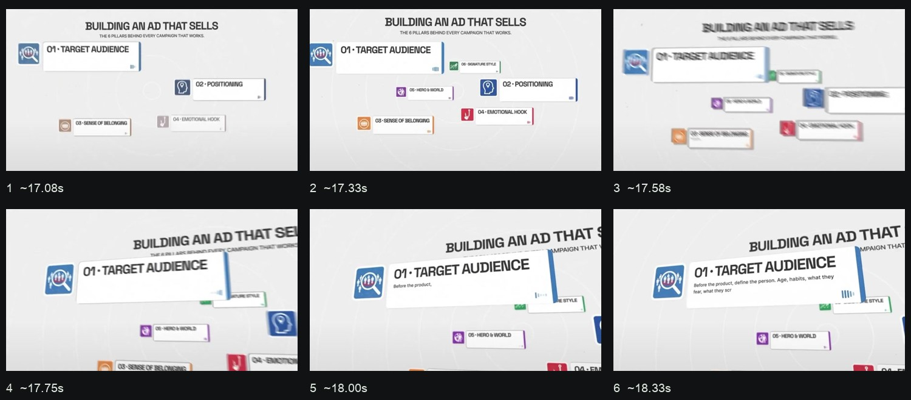

**全片流程：** 0-3.3s Supercomputer 字母重组与开关/Free Mode；3.3-5.7s 产品附件、打字；5.7-7.8s 模式下拉和提交；7.8-12.6s Working 时间、纵向任务节点、子任务条；12.6-16.5s 研究卡组和重点标记；16.5-21.2s 空间模块与镜头巡游；21.2-24.4s 返回回复、三种方案卡、选择；尾段控制中心。

**精彩组合：** 镜头移动到模块之后，正文才开始出现

**可见证据：** 约 17.0-17.33s 多个解释模块错峰建立；17.58-17.83s 镜头推近左上 Target Audience；18.0s 标题和卡片已收稳，正文才逐步出现；外围模块仍保留空间关系。

**实现推测：** 给整组布局一个相机父级，单卡正文有独立 reveal 时间。卡片透视、相机和文字不能共用一条机械式线性进度。

**调校起点：** 建议空间移动 0.4-0.6s，正文延后约 0.15-0.25s；读完一个主观点后再移向下一个，避免连续无停顿飞行。

**通用应用：** 解释人物一致性流程时可展示资产、主体库、@ 调用三个节点，背景网格始终同源；真实按钮步骤仍回到真实 UI。

**建议音效（非原片试听结论）：** 建议：任务节点轻敲、相机巡游柔短 whoosh、正文打字簇；解释阶段整体音量低于章节转场。
