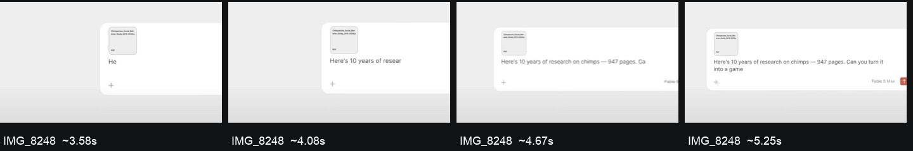
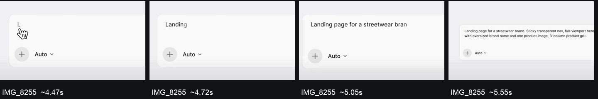
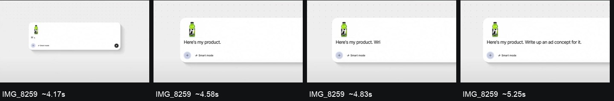

# 打字、点击、拖拽与容器交接

用于实现，不是原作者工程逆向结果。所有项目沿用用户当次提供的品牌规范。按需从 [16 段参考](higgsfield-16.md) 找画面依据。下列时长/曲线是调校起点，不是从成片测得的精确工程参数。

## 一份事件表驱动画面与音效

每次交互记录 `id, timeSeconds, target, phase, content, sfxCue`。相机、容器、文字、指针和声音都引用这份事件表，避免各自写独立延迟而越调越错位。区分镜头运动父级、界面布局层、拖拽临时层和光标；所有标注跟目标处于同一坐标变换。

输入/选择的状态链：空闲 → 获得焦点 → 输入中 → 候选出现 → 选择反馈 → 标签落位 → 提交 → 等待 → 真实结果接管。并非每段都要完整重复，但不能把必要因果顺序倒置。

## 有质感的打字

### 录屏依据
- 8248 约 3.5–5.7s：附件先存在，文字连续增长；输入过程中镜头拉回，句子换行仍留在同一容器。
- 8255 约 4.3–5.9s：光标先到，首词建立后较快补齐语句；镜头拉回给后续多行留空间。
- 8259 约 4.0–5.5s：首个短句约 4.58s 完成，约 4.58–4.75s 有短停顿，后续短语约 4.83s 继续。关键是句意分组与停顿，不是所有字同速打印。
- 8252 约 5.4–7.3s：语言关键词驱动对应卡片成为主角。可迁移到 @Genevieve / @Jacob 与头像卡的联动。

这些时间来自 12 fps 重采样，事件起止只能定位到附近采样区间；不要宣传为精确到毫秒的测量。

### 编排方法
1. 先给光标/输入区一个明确的焦点，再开始内容增长。光标落稳时触发首个字，不让鼠标停在无关位置。
2. 把句子切成 2–4 个短语。首词稍慢建立语境，后续短语更快，标点/语义转换处短暂停顿。建议短语间停顿 0.12–0.25s。
3. 字符以字素簇分割，避免切开 emoji、组合字符。中文可按 2–5 字短词组安排时序。重点是阅读节奏，不是机械模拟实际拼音输入法；若教程涉及输入法，应使用真实录屏。
4. 全段长提示词无需逐字复读。短示例用逐字；长提示词用快速粘贴与一小段追加，再留清晰的关键词/参数。正文不要同时逐字大幅缩放、跳动和发光。参考需要时允许小幅位置／透明度／模糊揭示及短暂柔光，保持最终文字核心清晰。
5. 输入框根据实际文本排版扩高或向上扩展，固定底部按钮或文字基线，按当前布局选择锚点。不要拉伸整个截图。预计算换行位置，避免一帧抖动。
6. 正文始终清晰。相机需要大幅移动时，暂停关键文字揭示或等相机基本收稳再开始。
7. 最后一个字符落稳 → 提交按钮产生短反馈 → 请求状态接管。不能最后一字尚未出现就显示完成结果。

## 点击与菜单变标签

参考 8255：符号触发菜单，选中项改变，菜单退出而两枚标签留下。产品的 @ 调用应保留真实头像、姓名和标签形态。
- 建议菜单打开 0.15–0.25s，点击局部反馈 0.10–0.18s，标签交接 0.20–0.35s。
- 标签不能无来源地凭空出现；至少保留候选项的身份/图标/颜色/位置中的明确线索。
- 胶囊边缘短光段可参考 8257，依控件真实圆角路径移动，经过后衰减；不是常驻荧光大框。
- 普通点击以按钮明暗、轻压缩、选中勾或标签落位表达。只有章节交接才把局部反馈扩成大环/全画面动效（8250）。

## 拖拽：抓取点、临时层、释放落位

参考 8245 与 8251。临时拖拽元素可以大于最终附件，接近槽位后再缩小。抓取时不必让指针强行位于图片中心；一旦抓取，局部抓取点应固定。
1. 确定源图和目标槽位的实际坐标、裁切模式、父级变换。
2. 拾起时把元素提升到临时层，保留抓取点；给轻微倾斜、阴影或大小差表达悬浮，不把人物图扭曲。
3. 运动路径保持明确主方向。建议拖动 0.25–0.60s，快速段可轻模糊，临近目标恢复清晰。
4. 释放时在 0.15–0.25s 内匹配槽位，完成后再交给槽位裁切层。交接前后同一帧的几何位置应一致，避免突然跳一格。
5. 正脸图保持肖像比例；三视图用横向 contain 或真实横向槽位，完整保留人物。不要为了统一头像卡把三人裁掉。
6. 实际产品没有拖放能力时，应使用录屏的文件选择/上传流程；艺术化素材飞入只作为资料归入的示意，不宣称真实拖放操作。

## 常用组合与参数起点

| 组合 | 参考 | 迁移 |
|---|---|---|
| 容器扩高 → 附件错峰 → 提交 | 8244 | 正脸与三视图补充到同一请求 |
| 拾起 → 跨画面移动 → 槽位收缩 | 8245/8251 | 素材入库示意 |
| 菜单 → 选中 → 留下标签 | 8255 | @ 主体调用 |
| 槽位错峰 → 结果第二轮错峰 | 8249/8254 | 资产/主体库结果 |
| 选中项保亮 → 其他项退暗 → 旧组上移 | 8248 | 选择角色后继续输入 |
| 主卡保留 → 周边收叠 → 文件夹遮挡 | 8247 | 多张资产归为一个主体 |
| 局部细节 → 拉回 → 关系解释 | 8256 | 身份与服装参考分工 |
| 模块建立 → 相机收稳 → 正文出现 | 8259 | 资产→主体库→调用流程解释 |

通用外出/入场可从 cubic-bezier(0.22, 1, 0.36, 1) 或编辑器等价 ease-out 开始，镜头贯穿段用连续速度的 ease-in-out 调整。这是建议，不是原片曲线。无必要时不加弹簧；需要松手重量感时只允许一次轻回弹。大位移通常 0.3–0.6s，同组错峰 0.06–0.14s；按物体距离和阅读时间调整。

## 验收

先原速看因果与阅读，再密查交接。检查：抓取点不漂；文字不拉伸；新旧容器不跳位；字体换行不抖；高亮随相机；遮挡顺序正确；最后结果真实可辨认。声音只有实际试听后才能验收音色和混音。没有试听能力就把声音交付标为候选设计，不说已达到参考听感。

## 打字加密图证

以下为各段的四个代表状态；每张图片下方标近似源时间，不是等距帧。

## v3：避免机械打字与排版破坏

区分内容增长的节奏和字符显现的质感：短语时点负责阅读，字符局部动画负责柔和进入。正文可用短的透明度过渡、小幅上移和快速去模糊；按参考调整，不让每个字都完整弹跳后下一个才启动。输入时镜头可以缓慢拉回或横移，快速甩镜避开必须读清的关键词。

AE 优先使用完整文字层和文字动画器／选择器以保留 kerning、连字和段落排版；确需拆字时基于整句实际排版位置定位。早期脚本曾用逐字包围框加固定间距推进，这会让英文 kerning、空格和复杂文字变形，不作为通用实现。HTML 也预先固定完整文本布局，再揭示字素或词，不逐帧重排整句。

源文本逐字符截断可表达真实打字，但若用户要求更柔顺，结合视觉揭示处理边缘，不仅提高打字速度。光标与当前文本末端、换行、输入框增高共用排版结果；文字出现的结束时点须早于提交反馈。

精细按钮状态链见 [镜头与光效](camera-and-light.md)。普通点击和菜单仍用较轻反馈，参考里的关键生成按钮可以使用点阵波与多层 bloom，不能让旧版的克制原则抹掉用户明确要求复刻的效果。
